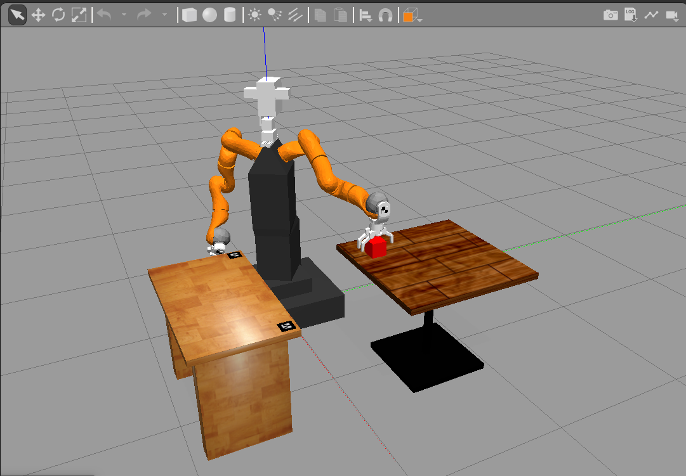
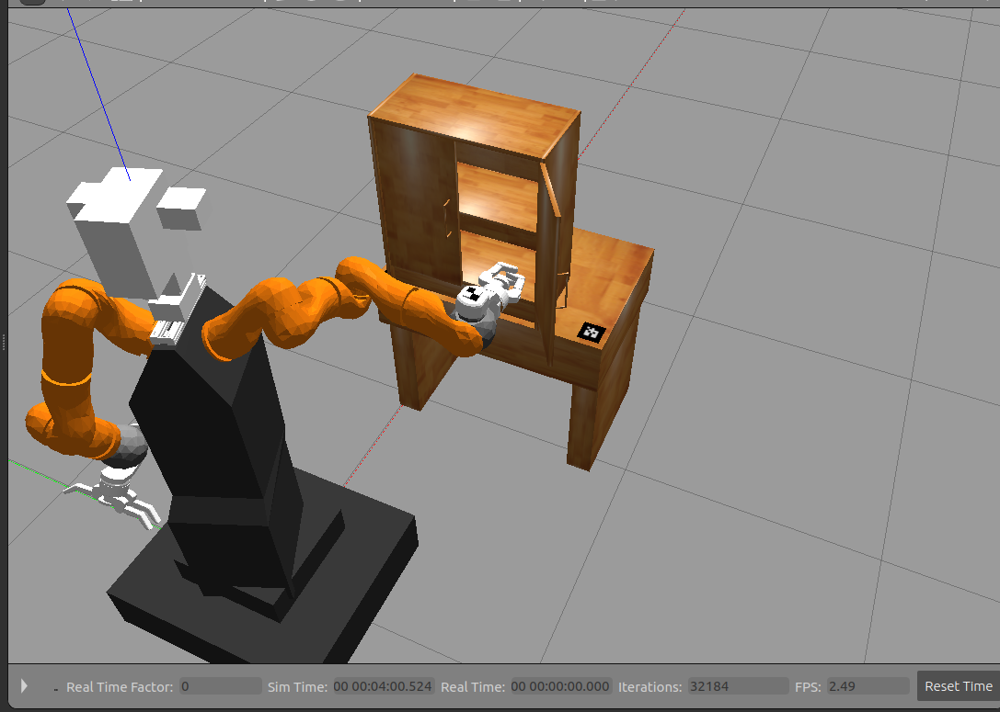
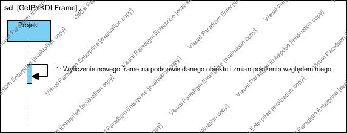

STERO
Michał Kwarciski, Kacper Marchlewicz
 Część manipulacyjna

Projekt 1  Dokumentacja   
   
Celem projektu jest implementacja, w Pythonie przy użyciu systemu Ros, algorytmu pozwalającego robotowi Velma zasymulować wykonania zadania PickAndPlace. W świecie symulacji stworzyliśmy 2 stoły i kostkę. 

Implementacja:   
Lista metod klasy zawierającej funkcje Velmy:   
__ini__() - inicjalizacja interfejsu Velmy, planera i octomapy, bazowanie robota   
homing() - funkcja służąca do bazowania robota   
goto_start_position() - funkcja wywoływana przez homing(), zadaje odpowiednie pozycje stawów   
normalize_angle() - funkcja wywoływana przez move_head(), normalizuje kąt pomiędzy obecnym i zadanym   
move_head() - funkcja wywoływana przez move_around(), służy do poruszania głową Velmy   
move_around() - funkcja służąca do wykonania ruchów głową Velmy, aby odkryć otoczenie przez robotem   
joint_mode() - funkcja służąca do przełączenia Velmy w tryb jnt_imp   
cart_mode() - funkcja służąca do przełączenia Velmy w tryb cart_imp   
change_gripper_state() - funkcja służąca do otwierania, bądź zamykania chwytaków   
cart_move() - funkcja służąca do poruszania w układzie kartezjańskim (CIMP)   
plan_and_execute() - funkcja służąca do wyznaczenia i wykonania planu dla ruchu w przestrzeni stawów (JIMP)     
inv_kin() - funkcja służąca do obliczenia kinematyki odwrotnej w celu znalezienia trajektorii do celu   
transformations_object() - funkcja służąca do obliczenia transformaty pozycji obiektu   
find_the_best_corner() - funkcja służąca do znalezienia punktu na docelowym stole, gdy jego środek jest poza zasięgiem   

Plik launch  
Znajduje się w nim:   
- inicjalizacja utworzonego przez nas świata 
- uruchomienie systemu Velmy 
- publikowanie pozycji klocka i obu stołów 
- uruchomienie odpowiedniej konfiguracji rviz 
- uruchomienie offline severa octomapy z utworzoną wcześniej octomapą 

Wykonanie programu: 
Program zaczyna się od inicjalizacji robota.    
Po poprawnej inicjalizacji następuje wejście robota w tryb ruchu w przestrzeni stawów.    
Popranie pozycji pudełka i stołów.   
Zaplanowanie i wykonanie trajektorii nad pudełko.   
Zmianę trybu ruchu na tryb kartezjański.   
Delikatne obniżenie się do obiektu.   
Chwycenie obiektu.   
Delikatne podniesienie obiektu.   
Zaplanowanie i wykonanie trajektorii do celu.   
Puszczenie obiektu.   
Podniesienie ramienia.   
Powrót do pozycji początkowej.     
Gotowość do ponownego uruchomienia.   

Uruchomienie programu:  
Uruchomienie programu wymaga wykonania poniższych komend w różnych terminalach:   
roscore - uruchomienie roscore   
roslaunch rcprg_gazebo_utils gazebo_client.launch - uruchomienie gazebo   
roslaunch stero_manipulation proj_1.launch - uruchomienie pliku launch   
rosrun stero_manipulation proj_1.py - uruchomienie algorytmu   

Prezentacja działania
octomapa rviz 

początkowe ustawienie świata 

ruch w kierunku kostki 

opuszczenie do kostki 

pochwycenie kostki 

uniesienie obiektu 

przeniesienie do celu 

odłożenie obiektu 

powrót do pozycji początkowej 

analogiczna kolejność dla drugiej ręki 

Diagramy SysML
Projekt 1 

Projekt 2  Dokumentacja   
   
Celem projektu jest implementacja, w Pythonie przy użyciu systemu Ros, algorytmu pozwalającego robotowi Velma zasymulować otwieranie drzwi szafki.

Implementacja:   
Funkcje użyte jak w projekcie 1.
Dodatkowe funkcje:  
get_PYKDL_frame() - funkcja zwracająca obiekt PyKDL o przesunięciu o zadane wartość w osiach x, y, z, bez rotacji 
moveCardImp() - funkcja służąca do wykonania prostego ruchu w płaszyśnie kartezjańskiej z możliwością modykikacji impedancji stawu.  

Plik launch - taki sam jak w projektcie 1.

Wykonanie programu: 
Program zaczyna się od inicjalizacji robota.    
Po poprawnej inicjalizacji następuje wejście robota w tryb ruchu w przestrzeni stawów.    
Popranie pozycji klamek i środków masy drzwi szafki.   
Wybór klamki i ręki, którą bedzie wykonywanie zadanie.  
Zaplanowanie i wykonanie trajektorii obok klamki.   
następuje wejście robota w tryb ruchu w przestrzeni kartezjańskiej.    
Przymkięcie palców i podsunięcie się do klamki.   
Złapanie klamki.  
Niepełne otwarcie szafki.  
Puszczenie szafki.  
Przesunięcie się ręki robota do pozycji, w której może "popchnąć" szfkę, żeby otrzorzyła się na zadaną szerokość.  
Popchnięcie szafki.  
Zmiana trybu pracy robota na ruch w przestrzeni stawów.  
Powrót do pozycji początkowej.     
Gotowość do ponownego uruchomienia.   

Uruchomienie programu:  
Uruchomienie programu wymaga wykonania poniższych komend w różnych terminalach:   
roscore - uruchomienie roscore   
roslaunch rcprg_gazebo_utils gazebo_client.launch - uruchomienie gazebo   
roslaunch stero_manipulation proj_1.launch - uruchomienie pliku launch   
rosrun stero_manipulation proj_2.py - uruchomienie algorytmu   

Prezentacja działania
   
 
   
  
   
   
   
   
   
   
   
   
   
   

Diagramy SysML
Projekt 2 

 

Diagramy SysML
Wspólne dla obu projektów 

</p
